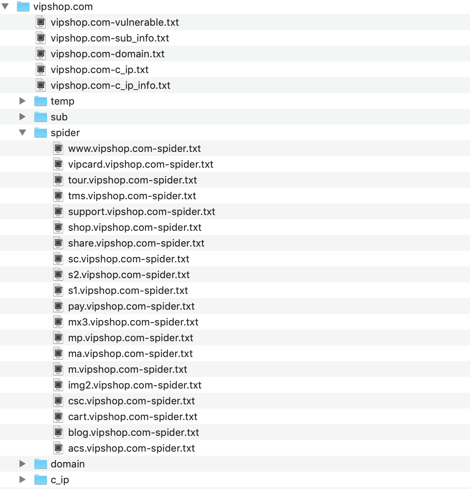
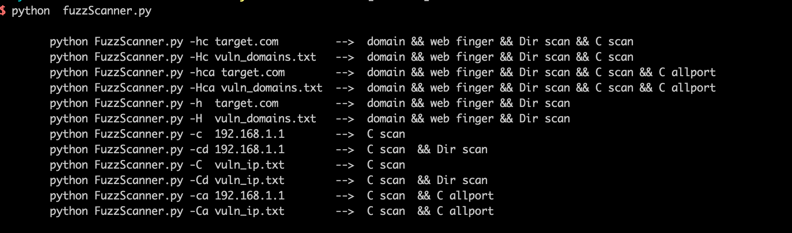
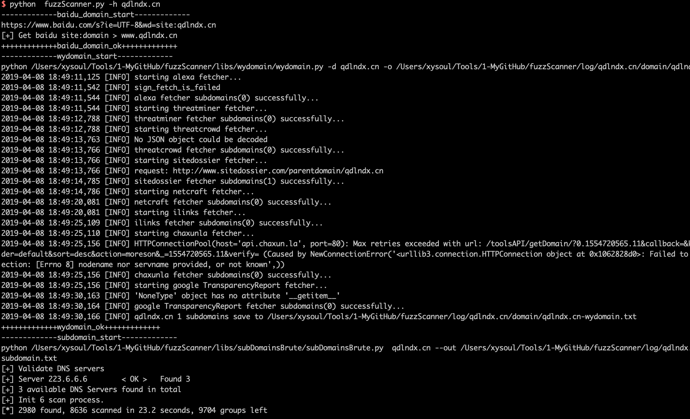
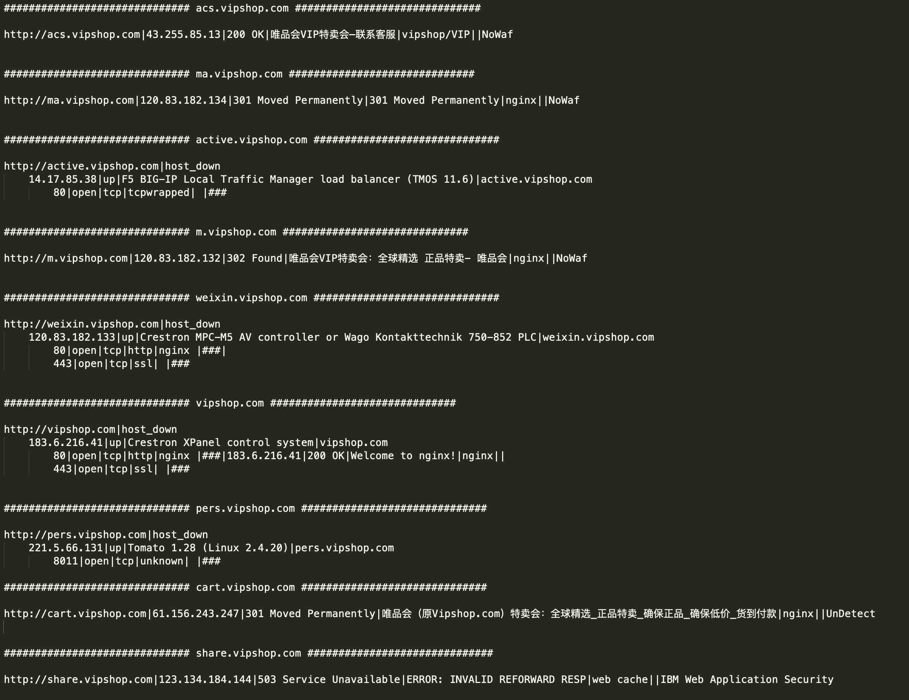
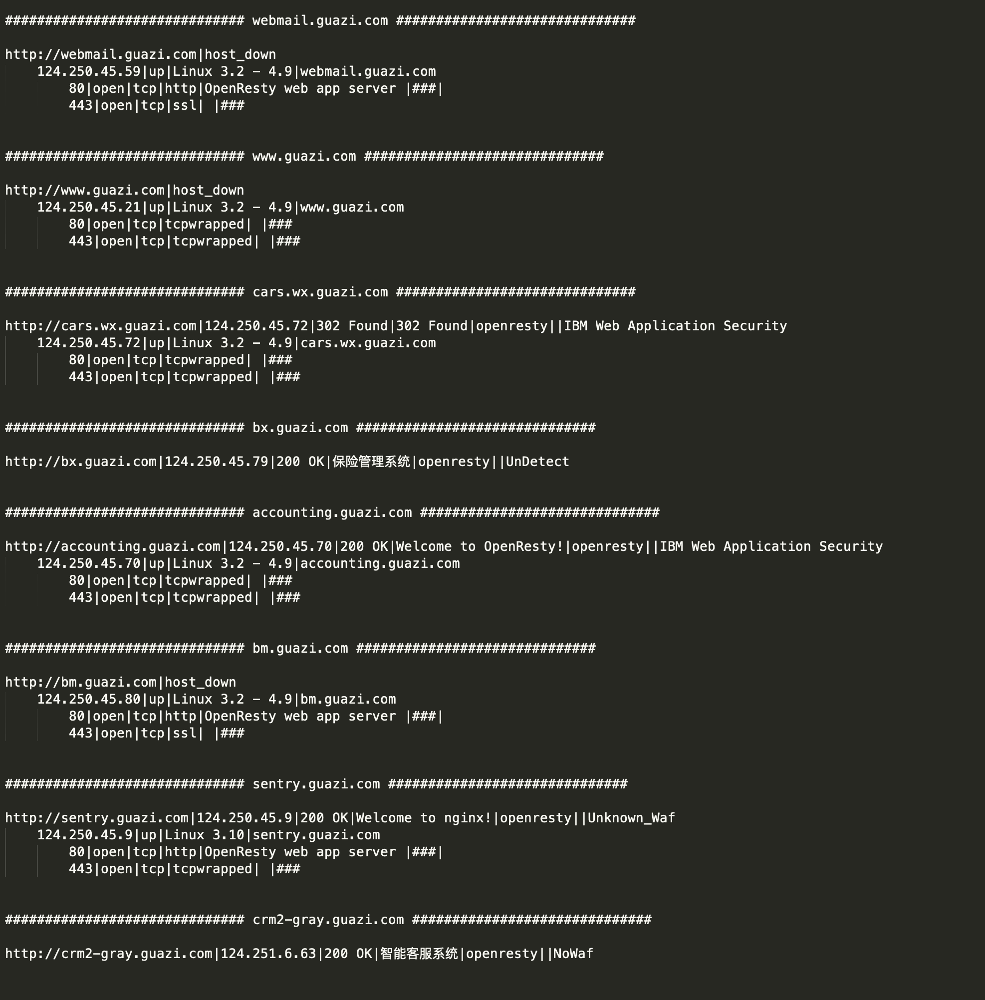

<div align=center></div>


# FuzzScanner
一个用来进行信息搜集的工具集，主要是用于对网站子域名、开放端口、端口指纹、c段地址、敏感目录、链接爬取等信息进行批量搜集。

fuzzScanner可用于批量快速的搜集网站信息，比别人更快一步的发现其他端口的应用或者网站管理后台等，也适合src漏洞挖掘的前期信息搜集。

开发初衷比较简单，当时正在参加一些攻防演练，需要快速的对目标网站进行子域名发现、端口扫描、目录扫描等，手头上有一些分散的工具，比如lijiejie的subdomains、子域名挖掘机、dirsearch等等，但当目标任务量比较大时，这些重复性的工作就会比较费时费力，所以就有了这么个集合十八种杀人武器于一身的“超级武器”——fuzzScanner。

```
因为当时着急用，所以很多功能的实现都是直接命令行调用的其他工具，再次非常感谢wydomain、WhatWeb、subDomainsBrute、dirsearch、wafw00f等开源平台。
```

# Change_Log

- [2018-04-05] 对多线程进行了优化，对异常进行了预处理
- [2018-04-03] 完成基础功能


# 安装

## 常规安装

平台开发和运行都是在linux环境下，windows未测试，wydomain、WhatWeb、subDomainsBrute、dirsearch、wafw00f等工具均已放在libs目录下，默认可直接调用。

使用比较简单：

从github上拖下来

```
git clone https://github.com/TideSec/FuzzScanner
```

安装requirements.txt依赖

```
pip install -r requirements.txt
```
安装ruby环境，以便运行whatweb

```
sudo yum install ruby    # CentOS, Fedora, 或 RHEL 系统
sudo apt-get install ruby-full # Debian 或 Ubuntu 系统
```
安装namp

```
yum install nmap  # CentOS, Fedora, 或 RHEL 系统
apt-get install nmap  # Debian 或 Ubuntu 系统
```

运行脚本，因为调用nmap需要root权限，所以需要sudo。

```
sudo python FuzzScanner.py 
```

## docker镜像

为了避免部署的各种问题，直接做了个镜像放在了阿里云上，docker直接pull下来就可以。

```
docker pull registry.cn-hangzhou.aliyuncs.com/secplus/tide-fuzzscanner:1.0

```
使用docker images查看docker镜像信息

```
root@Docker:~# docker images
REPOSITORY                                                   TAG                 IMAGE ID            CREATED             SIZE
registry.cn-hangzhou.aliyuncs.com/secplus/tide-fuzzscanner   1.0                 52341fc71d0a        5 minutes ago       1.36GB

```
创建docker并进入docker

```
docker run --name fuzzscanner -t -i 52341fc71d0a /bin/bash

```

执行fuzzscanner

```
root@Docker:~# docker run --name fuzzscanner -t -i 52341fc71d0a /bin/bash
[root@a7edd0d9fdad /]# cd /root/FuzzScanner/
[root@a7edd0d9fdad FuzzScanner]# python FuzzScanner.py 

        python FuzzScanner.py -hc target.com         -->  domain && web finger && Dir scan && C scan
        python FuzzScanner.py -Hc vuln_domains.txt   -->  domain && web finger && Dir scan && C scan
        python FuzzScanner.py -hca target.com        -->  domain && web finger && Dir scan && C scan && C allport
        python FuzzScanner.py -Hca vuln_domains.txt  -->  domain && web finger && Dir scan && C scan && C allport
        python FuzzScanner.py -h  target.com         -->  domain && web finger && Dir scan
        python FuzzScanner.py -H  vuln_domains.txt   -->  domain && web finger && Dir scan
        python FuzzScanner.py -c  192.168.1.1        -->  C scan
        python FuzzScanner.py -cd 192.168.1.1        -->  C scan  && Dir scan
        python FuzzScanner.py -C  vuln_ip.txt        -->  C scan
        python FuzzScanner.py -Cd vuln_ip.txt        -->  C scan  && Dir scan
        python FuzzScanner.py -ca 192.168.1.1        -->  C scan  && C allport
        python FuzzScanner.py -Ca vuln_ip.txt        -->  C scan  && C allport
```

# 使用

使用比较简单，参数设置说明。

```
python FuzzScanner.py -hc target.com         -->  domain && web finger && Dir scan && C scan 
                                                  设置单个目标网站，子域名枚举 && web指纹识别 && 目录枚举 && C段扫描

python FuzzScanner.py -Hc vuln_domains.txt   -->  domain && web finger && Dir scan && C scan
                                                  从文件读取单个或多个目标网站，子域名枚举 && web指纹识别 && 目录枚举 && C段扫描

python FuzzScanner.py -hca target.com        -->  domain && web finger && Dir scan && C scan && C allport
                                                  设置单个目标网站，子域名枚举 && web指纹识别 && 目录枚举 && C段全端口扫描
                                                  
python FuzzScanner.py -Hca vuln_domains.txt  -->  domain && web finger && Dir scan && C scan && C allport
                                                  从文件读取单个或多个目标网站，子域名枚举 && web指纹识别 && 目录枚举 && C段全端口扫描

python FuzzScanner.py -h  target.com         -->  domain && web finger && Dir scan
                                                  设置单个目标网站，子域名枚举 && web指纹识别 && 目录枚举 

python FuzzScanner.py -H  vuln_domains.txt   -->  domain && web finger && Dir scan
                                                  从文件读取单个或多个目标网站，子域名枚举 && web指纹识别 && 目录枚举

python FuzzScanner.py -c  192.168.1.1        -->  C scan
                                                  设置单个IP，进行C段地址探测

python FuzzScanner.py -cd 192.168.1.1        -->  C scan  && Dir scan
                                                  设置单个IP，进行C段地址探测并对web服务进行目录枚举

python FuzzScanner.py -C  vuln_ip.txt        -->  C scan
                                                  从文件读取单个或多个目标IP地址，进行C段地址探测

python FuzzScanner.py -Cd vuln_ip.txt        -->  C scan  && Dir scan
                                                  从文件读取单个或多个目标IP地址，进行C段地址探测并对web服务进行目录枚举

python FuzzScanner.py -ca 192.168.1.1        -->  C scan  && C allport
                                                  设置单个IP，进行C段地址探测和全端口扫描

python FuzzScanner.py -Ca vuln_ip.txt        -->  C scan  && C allport
                                                  从文件读取单个或多个目标IP地址，进行C段地址探测和全端口扫描
```


# 主要功能

- 子域名枚举

当输入目标站点域名后，会使用以下4种方式进行子域名的枚举。

```
1、百度链接爬取，会使用site：xxx.com为关键字爬取所有子域名；
2、网站友链爬取，会对自身3层链接目录进行爬取，搜集子域名；
3、本利想对chaxunla、aizhan之类的子域名查询接口进行查询，后来发现猪猪侠的wydomain已经实现了这个功能，就直接调用了wydomain；
4、使用了subdomains进行子域名的暴力枚举
```
- 端口扫描

端口扫描和指纹获取主要依赖于nmap，主要过程如下。该流程类似之前的另一个扫描器https://github.com/TideSec/WDScanner

```
1、首先根据参数设置情况判断是全端口扫描还是部分端口扫描；
2、如果扫描目标是网站地址，会根据目标开放的端口进行指纹获取，如果某端口服务为web服务，还会继续进行web指纹的获取；
3、如果扫描目标是ip地址或地址段，会先试用pynamp进行存活主机判断，然后使用socket端口探测的方式探测存活主机，然后再使用nmap进行端口的扫描和指纹的获取。
```

- 指纹识别

主要调用了whatweb、wafw00f、whatcms等进行了web指纹的识别。

```
1、当扫描web地址或探测到某端口为web服务时，会使用whatweb探测该站点信息，提取关键字段；
2、使用了wafw00f来探测是否存在waf，这样对有waf的不太好啃的站点可以暂时放弃；
3、对web站点进行了目录枚举，可能直接发行管理后台地址或备份文件等；

```

- 其他功能

在一些c段主机扫描、目录枚举、可能存在的威胁页面等方面进行了判断。

```
1、在扫描子域名时会解析其ip地址，并把改ip地址作为目标系统的C段地址，如设置了c段扫描的参数时会自动扫描其c段地址；
2、当扫描web地址或探测到某端口为web服务时，会自动进行了web指纹探测，并调用dirsearch进行目录枚举；
3、在检测到端口或Url地址中存在可能的漏洞点时，会输出到vulnerable.txt，比如.action及其他一些动态页面时。
```
- 结果保存

由于这些扫描结果需要后续人工逐个测试，为了方便就直接保存了txt，未保存数据库。

扫描完成后的结果保存log目录，最主要的就是该站点log根目录下的几个txt文档，比如下图中的vipshop.com-sub_info.txt、vipshop.com-domain.txt、vipshop.com-c_ip.txt、vipshop.com-c_ip_info.txt等。



```
1、sub目录下为各子站点的各相应详细信息，方便回溯；
2、spider是对各目标系统的爬虫记录，并区分了动态链接、外部链接等；
3、domain目录是wydomain、subdomians等的子域名记录；
4、c_ip目录为ip地址扫描的相关信息；
```

# 注意事项

1、在扫描c段时，如果选择了全端口扫描，速度会比较慢，但可能会有惊喜。适合有个服务器放上面慢慢跑。

2、如果选择了目录枚举，可能速度也会比较慢，目录枚举是直接用的dirsearch，在启用该功能后当发现某端口为web服务时就会调用dirsearch。

3、代码写的比较乱，单个文件1500行，导致后期我想再完善时看着头大。。感兴趣的可以一起探讨下~~

# Screenshot

参数设置



设置好目标后开始扫描



保存的主要结果，以vipshop.com和guazi.com为例，保存了网站信息、网站标题、中间件信息、waf信息、端口信息、目录扫描信息等等。






# Thanks

这个工具其实没什么技术含量，主要是集合了这些大牛的平台，再次感谢。

```
https://github.com/lijiejie/subDomainsBrute

https://github.com/ring04h/wydomain

https://github.com/EnableSecurity/wafw00f

https://github.com/urbanadventurer/whatweb

https://github.com/maurosoria/dirsearch
```

# 关注我们

Tide安全团队正式成立于2019年1月，是新潮信息旗下以互联网攻防技术研究为目标的安全团队，目前聚集了十多位专业的安全攻防技术研究人员，专注于网络攻防、Web安全、移动终端、安全开发、IoT/物联网/工控安全等方向。

想了解更多Tide安全团队，请关注团队官网: http://www.TideSec.net 或关注公众号：


